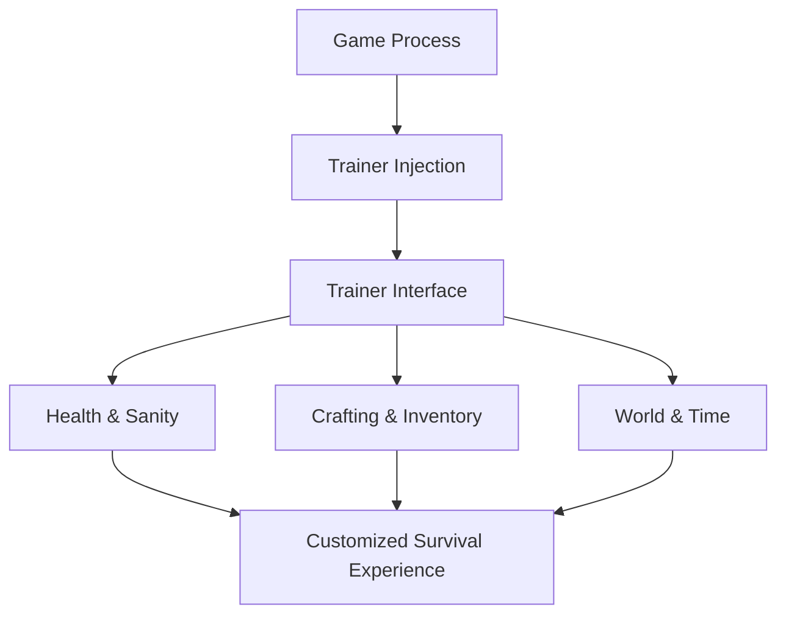

# Green Hell Trainer

Green Hell is a lesson taught by rain, fever, and silence.
The jungle doesn’t rush you — it *waits*.
For hunger. For infection. For one careless step.

**Green Hell Trainer** doesn’t silence that lesson.
It lets you *choose how hard it speaks*.

---

## 🌿 Overview

Green Hell Trainer is a **real-time survival adjustment tool** built for players who want control over intensity, pacing, and experimentation. It connects to the running game and allows live toggles — no restarts, no permanent save edits, no broken immersion.

Some days you want brutal realism.
Other days, you want to explore, learn, and breathe.

The jungle allows both.

---

## 🧰 Trainer Features

### ❤️ Health & Survival

* Infinite health
* No parasites, infections, or sanity loss
* Infinite stamina
* No hunger or thirst

### 🧠 Sanity & Status Control

* Freeze sanity level
* Disable hallucinations
* Instant recovery from injuries
* Prevent fatal status effects

### 🪓 Crafting & Resources

* Unlimited crafting materials
* Free crafting (no requirements)
* Instant crafting completion
* Tool durability lock

### 🌎 World & Time Tweaks

* Time control (pause / speed up / slow)
* No weight / infinite carry capacity
* Temperature resistance
* Animal aggression control

[!NOTE]
Every option is modular. Survival bends — it never collapses unless you ask it to.

---

## ⚡ How to Use

1. Launch Green Hell
2. Run the Trainer as administrator
3. Wait for game detection
4. Toggle options via hotkeys or menu
5. Adjust values live while surviving

Example “learning run” setup:

```text
• Infinite stamina
• No hunger or thirst
• Sanity locked
• Normal damage enabled
→ Explore systems without pressure
```

[!IMPORTANT]
For story immersion, avoid god mode on first playthroughs — the jungle’s voice matters.

---

## 🔁 Trainer Logic Flow



Immediate response. Gentle control. No interruption.

---

## ❓ FAQ

**Is this just god mode?**
No. Many players use it to reduce grind while keeping danger active.

**Will it corrupt my save?**
No — all changes apply only in memory.

**Can I toggle features mid-combat?**
Yes. Even during inspections or attacks.

**Is it useful for beginners?**
Very. It helps learn survival mechanics without constant death.

**Does it remove realism?**
Only if you let it. Subtle settings preserve immersion.

---

## 🌘 Final Thoughts

Green Hell is not about winning.
It’s about *enduring* — and understanding why you failed.

This Trainer doesn’t erase the jungle.
It gives you space to listen longer.

Walk deeper.
Learn slower.
And let survival become a dialogue, not a punishment.

---
